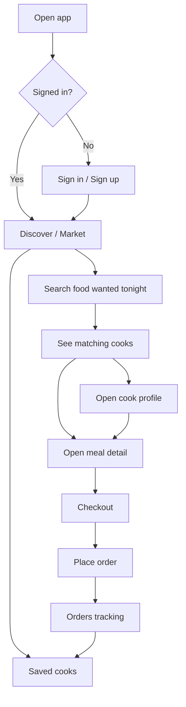
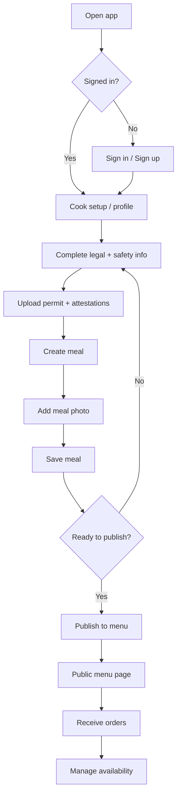
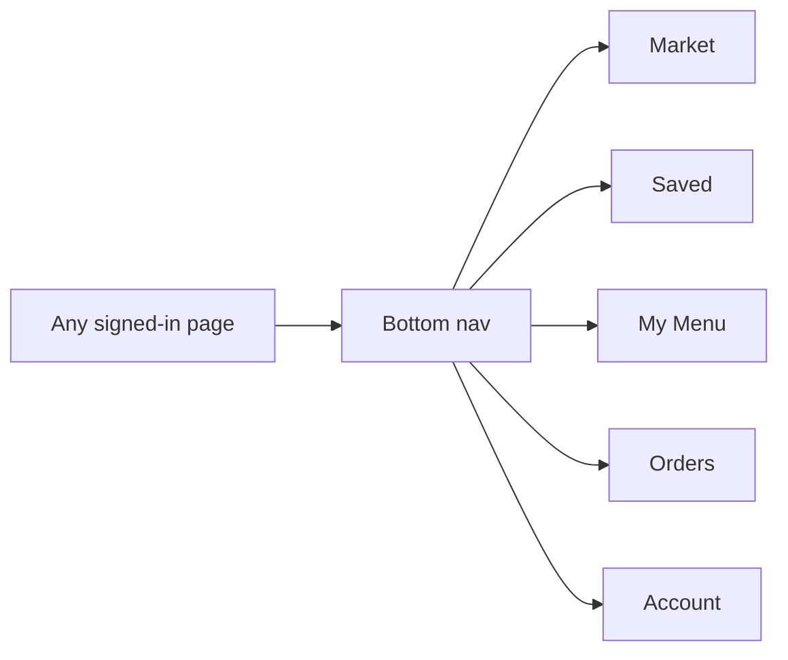

# Too Many Cooks Site Flowchart

## Customer Flow

## Cook Flow

## Shared Navigation

## One-Line Summary
Customers search for food and order it. Cooks complete compliance, publish meals with photos, and receive orders. The bottom nav keeps everyone from getting stuck.
